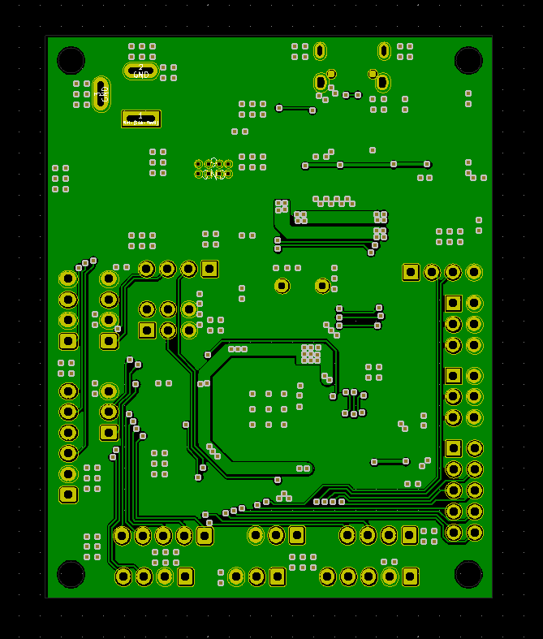
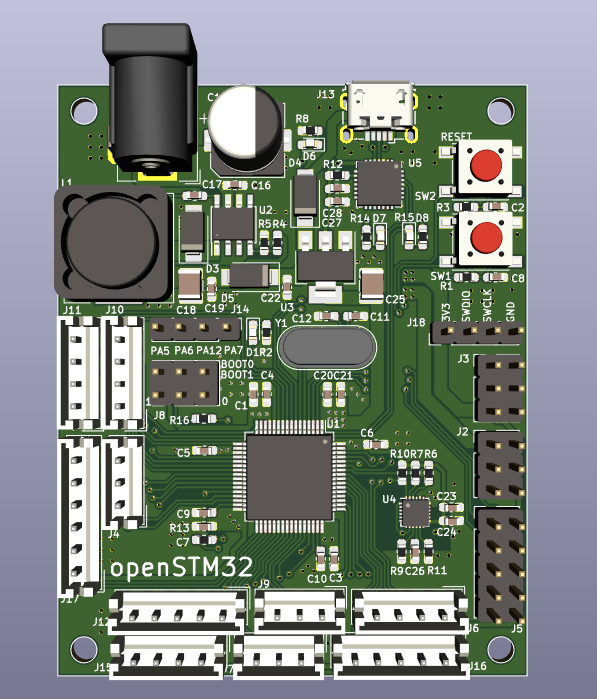
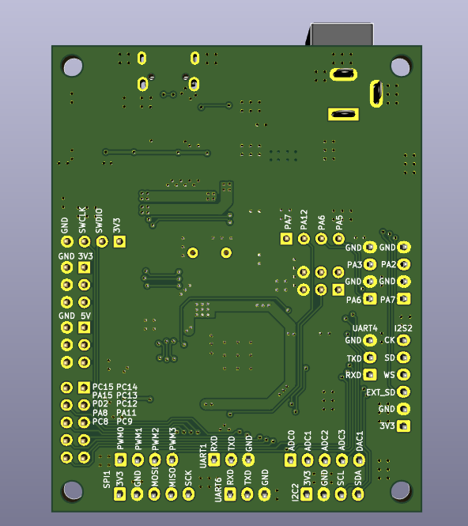

# openSTM32F4_LQFP64

### 1. Overview

Everything about this board: schematic, PCB gerber and BOM are free to distribute under open-source license for users.

The STM32F4 series chip inside openSTM32 board is based on ARM Cortex-M4 with floating point unit (FPU).

### 2. Specifications

| Items               | Specifications                                               |
| ------------------- | ------------------------------------------------------------ |
| Power supply        | 5V micro USB 5~36V Jack DC                              |
| Microcontroller     | STM32F405RGT6 / 32-bit ARM Cortex-M4 with FPU(168MHz, 225DMIPS) |
| Sensors             | 3 axis gyroscope, 3 axis accelerometer, 3 axis magnetometer (MPU9250) |
| Programmer          | JTAG/SWD connector Serial (UART3)                       |
| Communicaton Ports  | U(S)ART x 3 (asynchronous) I2C x 1 SPI x 1 (Full-duplex) |
| Multimedia          | I2S x 1 (Full-duplex)                                        |
| Analog input        | ADC channel x 5                                              |
| Analog output       | DAC channel x 1                                              |
| PWM                 | Timer PWM x 4                                                |
| Leds and buttons    | D7 and D8: USB communication D6: 3V3 power on D1: USER LED status x 1 SW2: Button reset SW1: USER button |
| Digital I/O         | 10 pins                                                      |
| Output power source | 5V max 3A (TPS5430 step-down converter) 3V3 max 1A (AMS1117 linear regulator) |
| Dimensions          | 68 x 64 mm                                                   |

**NOTE:**

This board auto select power supply when both USB and jackDC are powered.

### 3. Layout / Pin map

### 4. Hardware design

#### Schematic

#### Dimension

#### PCB Top

#### PCB Bot

#### 3D Top

#### 3D Bot

### 5. Bill of Materials (BOM)

Download BOM [here.](assets/bom.xlsx)

### 6. Gerber

Download PCB gerber [here.](assets/openSTM32_68x54mm.zip)

